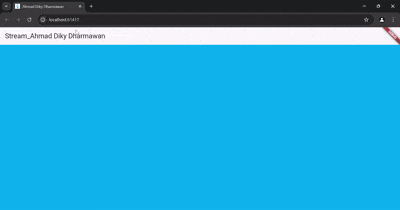

# dart_streams

# Ahmad Diky Dharmawan_362358302047

Soal 1
- Tambah nama Ahmad Diky Dharmawan pada tittle app
- Ganti warna tema
- Commit

Soal 2
- Tambah 5 warna pada variabel colors
- Commit

Soal 3
- yield*: Mendelegasikan iterasi ke iterable lain (seperti Stream, List, atau Set). Artinya, ia "menyerahkan" penghasilan nilai kepada iterable yang didelegasikan. Setiap nilai dari iterable tersebut akan di-yield satu per satu seolah-olah di-yield langsung oleh fungsi generator saat ini.

- Stream.periodic(const Duration(seconds: 1), (int t) {...}): Membuat sebuah Stream yang menghasilkan nilai secara periodik setiap 1 detik.
(int t): Fungsi callback yang diberikan ke Stream.periodic menerima sebuah integer t yang dimulai dari 0 dan bertambah setiap detik.
int index = t % colors.length;: Menghitung indeks berdasarkan modulus (%). Ini memastikan bahwa indeks selalu berada dalam rentang indeks yang valid dari list colors. Misalnya, jika colors memiliki 3 elemen, maka index akan berulang antara 0, 1, dan 2.
return colors[index];: Mengembalikan elemen dari list colors pada index yang dihitung.
yield*: Karena hasil dari Stream.periodic adalah sebuah Stream, yield* digunakan untuk "meratakan" stream tersebut. Setiap nilai yang dihasilkan oleh Stream.periodic akan di-yield satu per satu oleh fungsi getColors() yang Anda buat.

- Commit

Soal 4
- Buat fungsi untuk mengubah warna tema aplikasi
 

 

Soal 5
- Metode listen
Definisi:

listen adalah metode yang digunakan untuk mulai mendengarkan aliran data dari sebuah Stream. Ini adalah cara yang lebih "low-level" untuk menangani event dari stream.

- await for
Definisi:

await for adalah cara yang lebih sederhana dan lebih bersih untuk menangani aliran data dari Stream. Ini digunakan dalam konteks fungsi asinkron dan memungkinkan Anda untuk menunggu setiap event dari stream secara berurutan.

- Commit

## Getting Started

This project is a starting point for a Flutter application.

A few resources to get you started if this is your first Flutter project:

- [Lab: Write your first Flutter app](https://docs.flutter.dev/get-started/codelab)
- [Cookbook: Useful Flutter samples](https://docs.flutter.dev/cookbook)

For help getting started with Flutter development, view the
[online documentation](https://docs.flutter.dev/), which offers tutorials,
samples, guidance on mobile development, and a full API reference.
